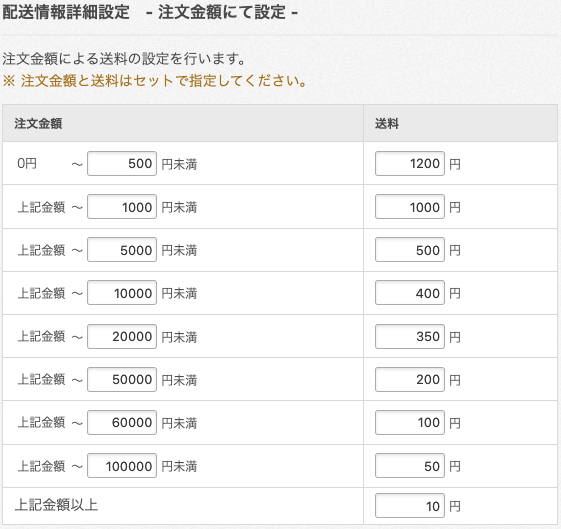
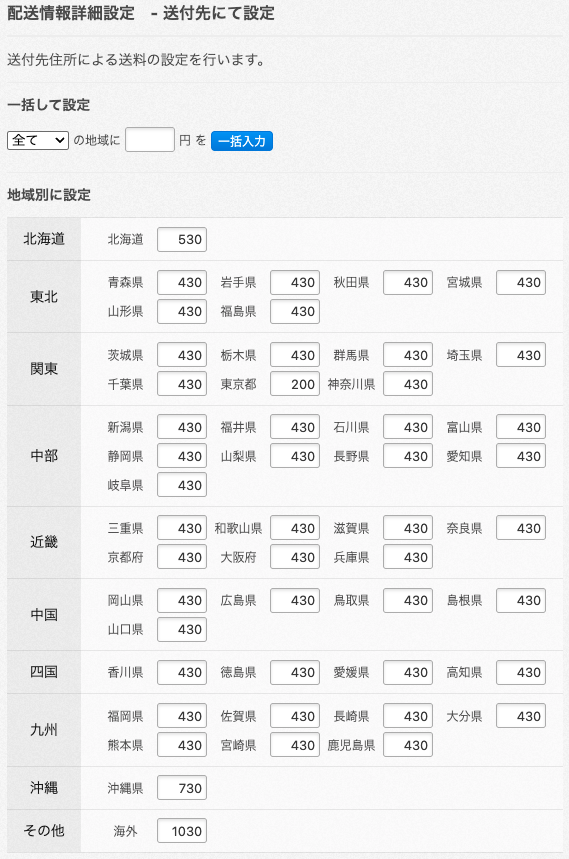
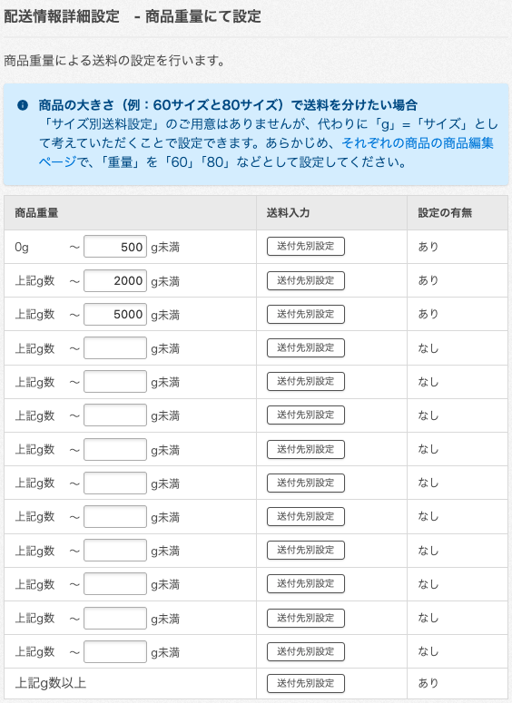
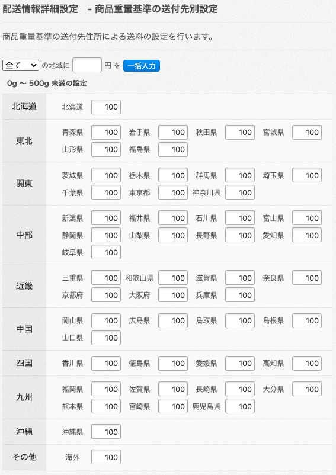

# 配送料の設定の実測記録

## この文書の位置づけと収集条件

この文書は、配送方法の配送料の設定（金額別の `charge.charge_ranges_by_price` / `charge.charge_max_price`、
送付先別の `charge.charge_ranges_by_area`、重量別の `charge.charge_ranges_by_weight` /
`charge.charge_ranges_max_weight`）を Entity でどう表すかの判断のため、実 API の挙動を記録する。現在のライブラリ仕様ではない。実測の出典は
この文書を追加・更新した各コミットであり、[ADR 0000](adr/0000-record-architecture-decisions.md) の
収集条件・検証可能性の規則に従う。

収集日は **2026-10-05（Asia/Tokyo）**。対象はテスト用ショップ。ショップのオーナーが管理画面で配送方法を
「注文金額にて設定」「送付先にて設定」「商品重量にて設定」にそれぞれ設定し、その画面の表記と、本ライブラリの
`Communicator\Request` による `GET /v1/deliveries` の応答を突き合わせた。API では読み取りだけを行った。

## 背景

公式 OpenAPI の `charge.charge_ranges_by_price` は、整数 2 要素の組の配列である。説明は「配送料が変わる
決済金額の区分」で、「`[3000, 100]` であれば、3000円以下の場合、手数料は100円であることを表す」とある。
`charge.charge_max_price` は「`charge_ranges_by_price` に設定されている区分以上の金額の場合の手数料」と
説明されている。

同じ形の代引き手数料（`payment.cod.fees`）では、公式 OpenAPI の「以下」という説明が誤りで、組の
第 1 要素はその区分に含まれない上限（未満）だった（[ADR 0011](adr/0011-represent-cod-fees-with-entity.md)、
[ColorMe Shop API 決済設定応答構造の実測記録](api-payment-structure.md)）。配送料でも同じかは確かめられていなかった。

## 観測

管理画面の設定と、同じ配送方法の API の応答は次のとおりだった。

| 管理画面の表記 | 送料 | API の値 |
| --- | ---: | --- |
| 0円 〜 500円未満 | 1200円 | `charge_ranges_by_price[0]` = `[500, 1200]` |
| 上記金額 〜 1000円未満 | 1000円 | `[1000, 1000]` |
| 上記金額 〜 5000円未満 | 500円 | `[5000, 500]` |
| 上記金額 〜 10000円未満 | 400円 | `[10000, 400]` |
| 上記金額 〜 20000円未満 | 350円 | `[20000, 350]` |
| 上記金額 〜 50000円未満 | 200円 | `[50000, 200]` |
| 上記金額 〜 60000円未満 | 100円 | `[60000, 100]` |
| 上記金額 〜 100000円未満 | 50円 | `[100000, 50]` |
| 上記金額以上 | 10円 | `charge_max_price` = `10` |

応答の `charge_type` は `by_price` だった。

*上の表の設定をした画面（ユーザー提供、2026-10-05）。*

**組の第 1 要素は、その区分に含まれない上限である。** 管理画面は「〜500円未満」と表記し、API は
`[500, 1200]` を返した。公式 OpenAPI の「3000円以下」という説明は、設定上の境界の説明として誤っている。
代引き手数料と同じ結果である。

**`charge_max_price` は、最後の区分の上限以上の金額に対する配送料である。** 管理画面の「上記金額以上」に
対応し、この例では 100000 円以上の配送料として `10` が返った。

金額別の配送料を設定していない配送方法では、`charge_ranges_by_price` は空配列、`charge_max_price` は
`null` だった。

## 送付先別の配送料（`charge_ranges_by_area`）

送付先（都道府県）ごとに送料を設定した配送方法の応答は、画面の設定と一致した。

| 管理画面 | 送料 | API の `charge_ranges_by_area` |
| --- | ---: | --- |
| 北海道 | 530円 | `pref_id` 1 の `charge` = `530` |
| 東京都 | 200円 | `pref_id` 13 の `charge` = `200` |
| 沖縄県 | 730円 | `pref_id` 47 の `charge` = `730` |
| その他：海外 | 1030円 | `pref_id` 48、`pref_name` = `海外` の `charge` = `1030` |
| 上記以外の都府県 | 430円 | 残りの 44 要素の `charge` = `430` |

各要素のキーは `pref_id` / `pref_name` / `charge` だった。

**海外は `pref_id` 48 として返る。** 一方、送付先別に設定された別の配送方法では、要素が 47 件で、海外の要素が
なかった（`pref_id` 1〜47）。**配送方法によって、海外の要素がある場合とない場合がある。** どの条件で
海外の要素が現れるかは確かめていない。

*送付先ごとに送料を設定した画面（ユーザー提供、2026-10-05）。*

## 重量別の配送料（`charge_ranges_by_weight` / `charge_ranges_max_weight`）

商品重量で送料を設定した配送方法の応答は、画面の設定と一致した。

| 管理画面の表記 | API の値 |
| --- | --- |
| 0g 〜 500g未満 | `charge_ranges_by_weight[0]` の重量 = `500` |
| 上記g数 〜 2000g未満 | `charge_ranges_by_weight[1]` の重量 = `2000` |
| 上記g数 〜 5000g未満 | `charge_ranges_by_weight[2]` の重量 = `5000` |
| 上記g数以上 | `charge_ranges_max_weight` |

`charge_ranges_by_weight` の各要素は `[重量, 送付先別の送料のリスト]` の組で、送付先別の送料のリストの各要素は
`charge_ranges_by_area` と同じ `pref_id` / `pref_name` / `charge` を持った。`charge_ranges_max_weight` も同じ形の
送付先別の送料のリストだった。いずれも海外（`pref_id` 48）を含む 48 要素だった。

**重量の上限は、その区分に含まれない（未満）。** 金額別の配送料と同じである。

画面で「設定の有無」が「なし」の行（重量を入力していない行）は、応答に現れなかった。

0g〜500g未満の区分の送付先別の設定画面では、海外を含む 48 欄すべてが 100 円で、`charge_ranges_by_weight[0]` の
48 要素の `charge` もすべて `100` だった。

*商品重量で送料を設定した画面（ユーザー提供、2026-10-05）。*

*0g〜500g未満の区分の送付先別の送料を設定した画面（ユーザー提供、2026-10-05）。*

## 確かめていないこと

- 実際の注文で、配送料がどの区分で計算されるか。確かめたのは管理画面の設定上の境界だけである
  （代引き手数料の記録と同じ限界）
- 区分の上限が昇順でない設定や、上限が同じ区分を重ねた設定を、管理画面が許すか
- 送付先別の送料に海外（`pref_id` 48）の要素が現れる条件
- 観測は 1 ショップで、金額別・送付先別・重量別それぞれ 1 つの設定である

## 関連

- [ADR 0011: 代引き手数料区分を専用 Entity で表現する](adr/0011-represent-cod-fees-with-entity.md)
- [ColorMe Shop API 決済設定応答構造の実測記録](api-payment-structure.md)
