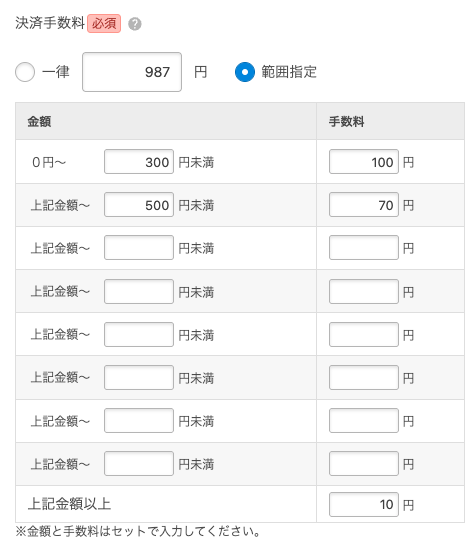

# ColorMe Shop API 決済設定応答構造の実測記録

## この文書の位置づけ

この文書は、ColorMe Shop API の実 API から収集した決済設定応答の一次情報を、ライブラリの型設計と将来の判断の根拠として保存するものであり、現在のライブラリ仕様を記述するものではない。

2026-09-16 にテスト用ショップで `GET /v1/payments` を実行し、固定手数料と区分手数料の代引き設定、その他決済、カード決済を観測した。2026-09-17 には銀行振込設定を追加して同じエンドポイントを再取得した。固定手数料の代引きだけを対象とした 2026-09-12 の調査後に、`changeable` による `cod` の構造差と区分手数料の境界を確認するため、設定条件を増やして再収集した。

ここに記録した内容は収集時点の実測結果であり、API 側の仕様変更によって古くなる可能性がある。内容を更新するときは、推測や過去の応答の流用ではなく、テスト用ショップで再収集する必要がある。

公開リポジトリには `account_id`、決済 ID、アクセストークン、契約コード、ショップ名、ショップ URL、口座情報を掲載しない。決済方法名などの検証用固有値も省き、API 語彙、値の型、`null`・欠損、設定との対応だけを記録する。

## 決済方法と条件付きオブジェクト

次の組み合わせを観測した。

| `type` | 公式上の種類 | 条件付きオブジェクトの観測 |
| ---: | --- | --- |
| `0` | 代引き | `cod` が存在する |
| `1` | 銀行振込 | `financial` が存在する |
| `9` | その他決済 | `financial` は存在しない。名称だけでは銀行振込設定か判定できない |
| `24` | GMO PG マルチペイメントクレジットカード | `card` が存在する |

## `cod` の構造と `changeable` による違い

管理画面の設定と API 応答には次の対応があった。実決済時の手数料計算自体は観測していない。

| `cod.changeable` と設定 | `Payment.fee` | `cod` の観測結果 |
| --- | --- | --- |
| `false`（一律手数料） | integer が存在する | `changeable` だけが存在し、`fees`、`fee_max`、`changeable_by_total` は欠損した |
| `true`（区分手数料、上限手数料未設定） | 一律手数料の入力値が integer として残る | `fees` は2整数のタプルの配列、`fee_max` は明示的な `null`、`changeable_by_total` は boolean |
| `true`（区分手数料、上限手数料設定済み） | 一律手数料の入力値が integer として残る | `fees` は2整数のタプルの配列、`fee_max` は integer、`changeable_by_total` は boolean |

`changeable=true` でも `Payment.fee` は消えない。この値が実決済時の手数料計算に使われるかは未観測である。`fees=[]` も未観測であり、その場合の `fee_max` の意味は推測しない。

## 区分手数料の設定上の境界

管理画面の「円未満」「上記金額以上」という表記と GET 応答を突き合わせ、`cod.fees` の各タプルの第1要素が、設定上、その区分に含まれない**排他的上限**であることを確認した。第2要素はその上限未満の区分に設定された手数料である。最大の上限以上には、設定されていれば `cod.fee_max` が対応する。

したがって、境界値そのものは前の区分ではなく次の区分へ入り、最大の境界値は `fee_max` の区分へ入る。これは管理画面と保存された設定の対応についての観測であり、実決済時の計算結果は未観測である。

## 管理画面との対応

*区分手数料と上限手数料を設定した画面（ユーザー提供、2026-09-16）。*

| 管理画面 | API |
| --- | --- |
| 一律手数料 / 範囲指定 | `Payment.fee` / `cod.changeable` |
| 各「上限未満」の区分 | `cod.fees[]` の `[排他的上限, 手数料]` |
| 最大の上限以上 | `cod.fee_max` |
| 区分判定に使う金額 | `cod.changeable_by_total` |

画像は手数料の設定欄だけを含み、ショップ名、ショップ URL、アカウント ID、決済 ID、認証情報など、ショップを特定できる情報は含まれていない。

## 公式 OpenAPI との差分

[公式 OpenAPI](https://api.shop-pro.jp/v1/spec/open_api.json) を 2026-09-16 に取得し、`GET /v1/payments` の 200 応答を確認した。

- `cod.fee_max` は `type: integer` で nullable 指定がなく、required にも指定されていない。実 API では、区分手数料で上限手数料を未設定にするとキーが存在して `null` になり、固定手数料ではキー自体が欠損した。
- OpenAPI は `fees` のタプルを「上限以下」と説明するが、管理画面と応答の対応では「上限未満」であり、設定上の境界説明が誤っている。
- OpenAPI の `fee_max` が最後の閾値以上に適用されるという説明は、管理画面と応答の対応に一致する。
- `fees` は配列の配列で、内側の配列には `minItems: 2` と `maxItems: 2` が指定されている。実応答でも2整数のタプルを観測した。
- `changeable_by_total=false` は、区分判定に決済総額ではなく商品合計額を用いる設定に対応した。

## `card` の構造

`type=24` の決済には `card` が存在し、`brands` は配列だった。各要素には `id: integer` と `name: string` が常に存在し、欠損・`null` は観測しなかった。ブランド名や ID の個別値は、構造判断に不要なため記録しない。

## `financial` の構造（2026-09-17 再取得）

テスト用ショップの `GET /v1/payments`（HTTP 200）で、`type=1`（銀行振込）の決済に `financial` object が存在した。`type=9` のその他決済には、名称にかかわらず `financial` キーがなかったため、決済名だけでは銀行振込設定の有無を判定できない。

| API キー | 観測結果 | 管理画面の対応欄 |
| --- | --- | --- |
| `name` | 非空 string、常に存在 | 金融機関名（必須） |
| `branch_name` | 非空 string、常に存在 | 支店名（必須） |
| `kouza_type` | string、普通口座を表す API 語彙 `saving` を観測 | 口座種別 |
| `kouza_number` | 非空 string、常に存在 | 口座番号（必須） |
| `kouza_name` | 非空 string、常に存在 | 口座名義（必須） |
| `branch_number` | 明示的な `null`、キーは存在 | 管理画面に対応欄なし |

`branch_number` は公式 OpenAPI に定義されていない。他の設定でも常に `null` になるとは判断できない。

*銀行振込決済の設定フォーム（ユーザー提供、2026-09-17）。画面の表示部分にショップ識別情報や口座の実値は含まれず、公開画像のメタデータも除去した。*

管理画面には上記項目に対応する入力欄があり、口座種別は「普通」「当座」から選択し、未選択にはできない。マスク済み応答による `Entities\Payment\Financial` の構築と getter 呼び出しは成功した。ただし、古い設定や他ショップの応答は未検証であり、欠損・`null` が存在しないことまでは保証できない。

## 現在のライブラリでの扱い

現在の `Cod` Entity は、`fees`、`fee_max`、`changeable_by_total` のキー欠損または明示的な `null` を受け入れ、各 getter は `null` を返す。`fees` が存在する場合は2整数のタプルを `CodFee` の list へ変換し、空配列は空 list として保持する。不正なタプルは要素位置を示す `InvalidFieldException` になる。`getRaw()` は元のタプルとキーの有無を保持する。

`Cod::toArray()` は `fees` に `CodFee` object の list を含み、`toArrayRecursive()` は各要素を `upper_limit` と `fee` の連想配列へ変換する。再帰配列化では既定で `null` の項目を省略し、`false` を渡すと残す。この実装判断は [ADR 0011](adr/0011-represent-cod-fees-with-entity.md) と [ADR 0012](adr/0012-allow-nullability-from-api-observations.md) に従う。

`Financial` の OpenAPI 定義済みプロパティは現在、非 nullable である。観測では欠損・`null` がなく、管理画面からも未入力にできないため nullable 化する条件を満たさない。`branch_number` は未宣言の未知キーとして hydrate 時に無視され、`getRaw()` には残る。

## 再収集の概要

再収集はテスト用ショップで行い、認証情報やマスク前のレスポンスを公開リポジトリへ保存しない。

1. 固定手数料、上限手数料が未設定の区分手数料、上限手数料を設定した区分手数料の代引きを用意する。銀行振込決済も設定し、口座項目には架空のテスト用データを入力する。
2. 必要な権限を持つテスト用アクセストークンで `GET https://api.shop-pro.jp/v1/payments` を実行する。認証ヘッダーはログやレポートへ出力しない。
3. HTTP ステータスとレスポンスボディを一時的な非公開領域へ保存し、トップレベルの `payments` が配列であることを確認する。
4. 各要素の `id`、`name`、`type`、`fee` と、`cod`、`card`、`financial` の有無を確認する。`cod` では `changeable` ごとに `fees`、`fee_max`、`changeable_by_total` のキーの有無、値、型を区別する。`financial` では各項目と `branch_number` のキーの有無、`null`、空文字列を区別する。
5. 管理画面の「円未満」「上記金額以上」と API の `fees`、`fee_max` を突き合わせ、境界が排他的上限であることを確認する。
6. 公式 OpenAPI を同日に取得し、`required`、`nullable`、配列要素の制約、`fees` の境界説明を実応答と比較する。
7. 公開前に ID、金融情報の実値、アクセストークン、契約コード、ショップ名、ショップ URL、検証用の固有名が含まれていないことを再確認する。画像のメタデータも確認する。

API の仕様変更を検知するため、再収集後はキーの有無、型、`null`、境界、公式 OpenAPI との差分、収集日を新しい観測へ更新する。
